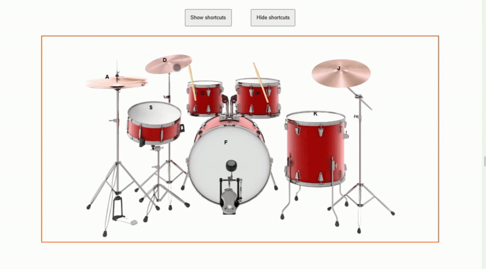
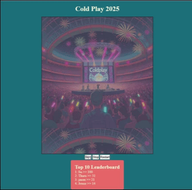

  
  
  
  

I’m a Software Engineer who thrives on solving problems, whether it's complex web development or challenges that don’t come with a manual. 
I specialize in full-stack web development, building clean, scalable, and high-performing solutions across the stack. I pick up new technologies quickly, retain 
what I learn, and apply it with precision. From intuitive frontends to powerful backends and everything in between, I bring energy, creativity, and grit to 
every line of code.

See [my website](https://binukandagedon.net) for more information!

<h1 align="center">Projects</h1>
<table bordercolor="#66b2b2">
  
  <tr>
    <td width="50%" valign="top">
      <h3 align="center">BUN CIRCLE Senior Care Home</h3>
         
      
         
        

          
  
  
      

        
<strong>Javascript, HTML, CSS and APIs</strong> - Built a fully responsive website for my client’s elderly care home. Integrated Calendly API so families 
can easily book appointments online. Smooth, accessible, and user-friendly..

    </td>
        <td width="50%" valign="top">
      <h3 align="center">Drumkit</h3>
       
        
       
        

  
  
      

        
<strong>HTML5, CSS3, & Javascript</strong> - A fully functional and responsive drum kit using image maps and animations, allowing users to 
play the drums interactively using either the mouse or keyboard.

    </td>
  </tr>
  
  <tr>
        <td width="50%" valign="top">
      <h3 align="center">Cold Play 2025</h3>
         
        
         
        

          
    
  
      

        
<strong>Javascript, Node.js, Express.js, Supabase, Local storage</strong> - I built a canvas-based game with Vite + Supabase where you score by bouncing the ball and compete on a global leaderboard (top 10 saved).

    </td>
    <td width="50%" valign="top">
      <h3 align="center">Client Porftfolio Site</h3>
         
        
         
        

          
  
  
      

        
<strong>HTML5, CSS3, & Javascript</strong> -  A fully responsive "About Me" page for one of my clients, ensuring it looks and functions 
perfectly across all devices.

    </td>
  </tr>
</table>

<h1 align="center">Technologies</h1>

    
    
    
    
    
    
    
    
    
    
    
    
    
    
    
    
    
    

---

<h1 align="center">Connect</h1>

  
  
  
  

